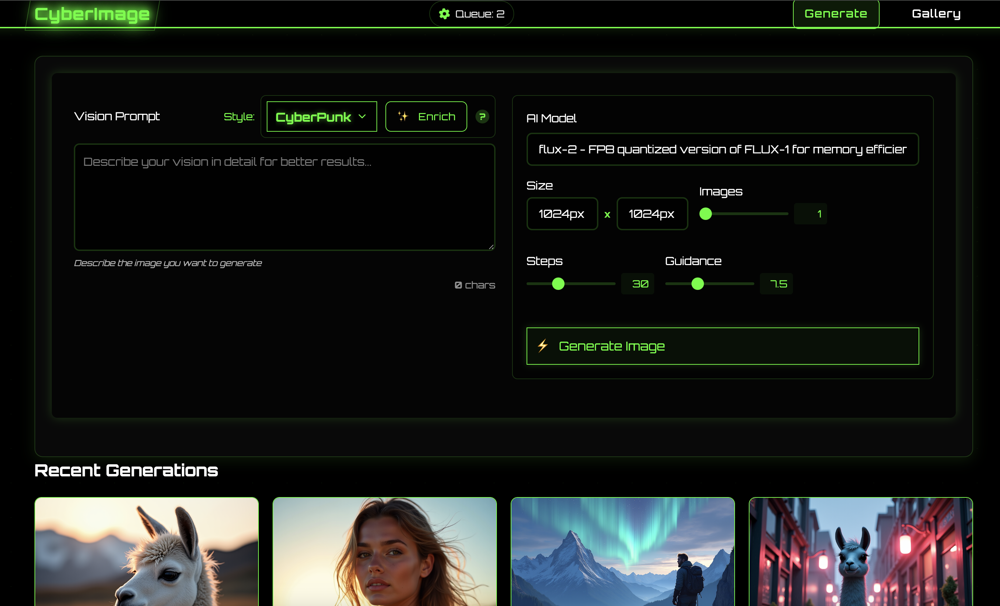
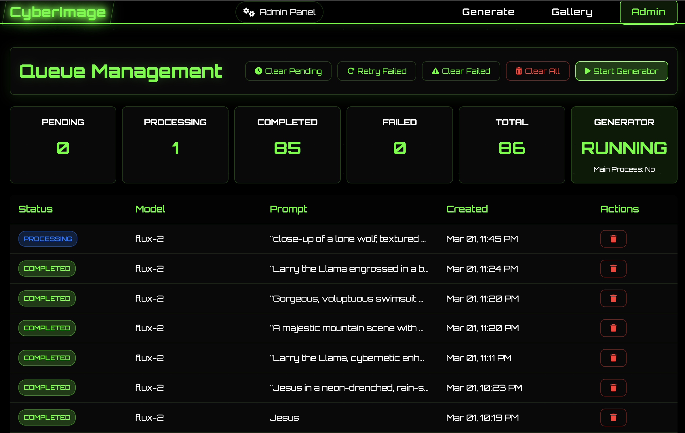
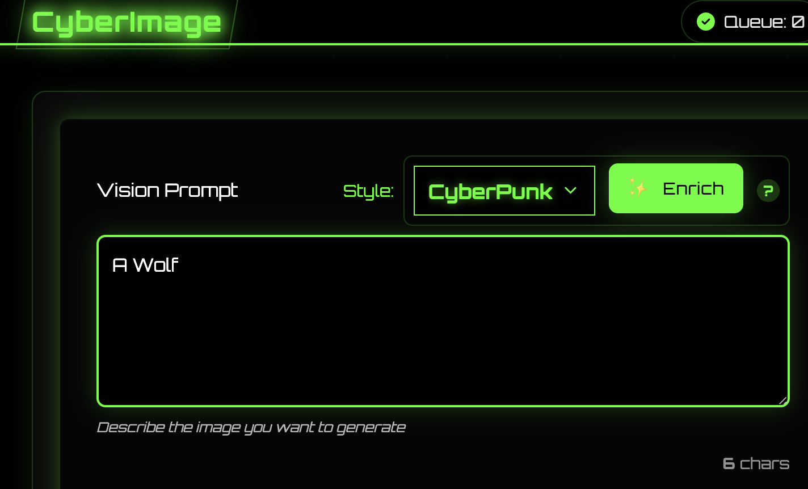

# CyberImage

**AI Image Generation Platform**

<table>
<tr>
<td></td>
<td></td>
</tr>
<tr>
<td></td>
<td></td>
</tr>
</table>

<div align="center">

🎨 Stable Diffusion | 🌍 Web Interface | ⚡ Fast | 🎯 Precise | 🖼️ Gallery | 🔄 Queue System | 📡 API

</div>

## 🌟 Features

<div align="center">

| 🎨 **Image Generation** | 🖥️ **Web Interface** | 🖼️ **Gallery Features** | ⚡ **Performance** |
|------------------------|---------------------|------------------------|-------------------|
| 🤖 State-of-the-art AI models | 🌃 Cyberpunk-themed UI | 📊 Multiple view options | 💾 Smart model caching |
| 🎛️ Customizable parameters | ⏱️ Real-time status updates | 🔍 Detailed image modal | 🧠 Memory optimization |
| 🚫 Negative prompt support | 🖱️ Interactive gallery | ⬇️ Quick download actions | 🔄 Efficient queue system |
| 📦 Batch image generation | 📱 Mobile-responsive design | 🗑️ Easy deletion options | 🏃‍♂️ Background processing |
| 📈 Real-time progress | ⌨️ Keyboard shortcuts | 📋 Copy prompt feature | 📊 Progress tracking |
| 🧠 Smart queue management | 📝 Metadata viewing | 🔄 Infinite scroll loading | 🔒 **Security & Privacy** |
| 🎯 Precise control | 🌈 Beautiful UI | 🔍 Search and filtering | 🛡️ No data collection |
| 🚀 Fast generation | 🎮 Intuitive controls | 📑 Batch operations | 🏠 Local image storage |
| 🧩 Model compatibility | 🔔 Notifications | 🏷️ Tagging system | 🔐 Secure file handling |
| 🔄 Seamless workflow | 🌙 Dark mode support | 📅 Date organization | 🕵️ Privacy-focused design |

</div>

## The Enhance/Enrich Button

The Enrich button uses the openai api to enhance the image. It uses the openai api key and the openai model to enhance the image. The openai model is the same as the model used for generation.

This is my favorite feature, it allows you to take a basic image prompt and enhance it to make it better using a number of different techniques shared with myself by an AI expert.

<table>
<tr>
<td></td>
<td></td>
</tr>
</table>


## ⚡ Installation

### Requirements

| Requirement | Specification |
|-------------|---------------|
| Python | 3.12 (for local installation) |
| GPU | CUDA-capable |
| RAM | 16GB+ recommended |
| VRAM | 24GB+ recommended |
| Disk Space | 250GB+ for models |
| Container | Docker & Docker Compose (for containerized installation) |
| API | Huggingface API Key (free! for downloading models) |

### Environment Setup
1. Copy the example environment file:
```bash
cp .env.example .env
```

2. Configure the environment variables in `.env`:

- For a local install, you can use the MODEL_FOLDER and IMAGES_FOLDER to store the models and images locally in different directories.

- For a docker install, you can use the EXTERNAL_MODEL_FOLDER and EXTERNAL_IMAGES_FOLDER to store the models and images externally in different directories.

- For a docker install, you will need a Huggingface API Key to download the models.

- The openai endpoints works fine with Ollama with 127.0.0.1:11434/v1 as the endpoint and the openai api key as the key, or host.docker.internal:11434/v1 as the endpoint and the openai api key as the key if ollama is running on the host machine. The model needs to be something in 127.0.0.1:11434/v1/models on your system.

> ***If you don't configure the openai endpoint, the enrich prompt will not work.***

- The civitai api key is optional, it is used to download models from civitai (not configured currently).

```env
MODEL_FOLDER=./models
IMAGES_FOLDER=./images
EXTERNAL_MODEL_FOLDER=
EXTERNAL_IMAGES_FOLDER=
HF_TOKEN=
OPENAI_ENDPOINT=
OPENAI_API_KEY=
OPENAI_MODEL=
CIVITAI_API_KEY=
```

### Docker Installation (Recommended)

  1. Clone the repository:
```bash
git clone https://github.com/ramborogers/cyberimage.git
cd cyberimage
```
2. Use the run.sh script to start the application (easiest):
```bash
# This will start the application in a container
./run.sh start
```

3. Using docker-compose :
```bash
# Start the application
docker-compose up -d

# View logs
docker-compose logs -f

# Stop the application
docker-compose down
```

3. Using Docker directly:
```bash
# Build the image
docker build -t cyberimage .

# Run the container
docker run -d \
  --name cyberimage \
  --gpus all \
  -p 7860:5050 \
  -v $(pwd)/models:/app/models \
  -v $(pwd)/images:/app/images \
  --env-file .env \
  cyberimage
```

4. Open in browser:
```
http://localhost:7860
```


### Local Installation

1. Clone the repository:
```bash
git clone https://github.com/ramborogers/cyberimage.git
cd cyberimage
```

2. Create a virtual environment:
```bash
python -m venv venv
source venv/bin/activate  # Linux/Mac
# or
.\venv\Scripts\activate  # Windows
```

3. Install dependencies:
```bash
pip install -r requirements.txt
```

4. Download models:
```bash
python download_models.py
```

### Generation Parameters
- **Model**: Choose from multiple AI models
- **Prompt**: Describe your desired image
- **Negative Prompt**: Specify elements to exclude
- **Size**: Select output dimensions
- **Steps**: Control generation quality
- **Guidance**: Adjust prompt adherence
- **Batch Size**: Generate multiple images

## 💡 Use Cases
- **Family Images**: My children love to use this
- **Digital Art**: Create unique artwork
- **Concept Design**: Generate design ideas
- **Visual Inspiration**: Explore creative concepts
- **Content Creation**: Generate visual content


## 🔧 Configuration

Key settings in `.env`:
```python
# Model Settings

# Don't change these unless you are NOT using docker
MODEL_FOLDER=./models
IMAGES_FOLDER=./images

# For usage with docker (models will grow > 250GB)
EXTERNAL_MODEL_FOLDER=
EXTERNAL_IMAGES_FOLDER=

# Huggingface API Key (free! for downloading models)
HF_TOKEN=

# OpenAI API Key (for enrich prompt), ollama works fine with 127.0.0.1:11434/v1 as the endpoint and the openai api key as the key, or host.docker.internal:11434/v1 as the endpoint and the openai api key as the key if ollama is running on the host machine. The model needs to be something in 127.0.0.1:11434/v1/models on your system.
OPENAI_ENDPOINT=
OPENAI_API_KEY=

# OpenAI Model (for enrich prompt button to work)
OPENAI_MODEL=

# Civitai API Key (optional, for downloading models) (not configured currently)
CIVITAI_API_KEY=
```


## 🤝 Contributing

1. Fork the repository
2. Create a feature branch
3. Commit your changes
4. Push to the branch
5. Create a Pull Request

<div align="center">

## ⚖️ License

<p>
NetVentory is licensed under the GNU General Public License v3.0 (GPLv3).<br>
<em>Free Software</em>
</p>

[](https://www.gnu.org/licenses/gpl-3.0)

### Connect With Me 🤝

[](https://github.com/RamboRogers)
[](https://x.com/rogerscissp)
[](https://matthewrogers.org)


</div>

---

Made with 💚 by [Matthew Rogers]