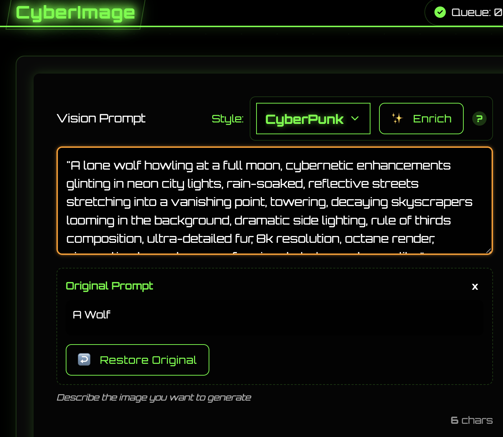

# CyberImage

**AI Image Generation Platform**

<table>
<tr>
<td></td>
<td></td>
</tr>
<tr>
<td></td>
<td></td>
</tr>
</table>

<div align="center">

🎨 Stable Diffusion | 🌍 Web Interface | ⚡ Fast | 🎯 Precise | 🖼️ Gallery | 🔄 Queue System | 📡 API | 🤖 MCP Support

</div>

## 🌟 Features

<div align="center">

| 🎨 **Image Generation** | 🖥️ **Web Interface** | 🖼️ **Gallery Features** | ⚡ **Performance** |
|------------------------|---------------------|------------------------|-------------------|
| 🤖 State-of-the-art AI models | 🌃 Cyberpunk-themed UI | 📊 Multiple view options | 💾 Smart model caching |
| 🎛️ Customizable parameters | ⏱️ Real-time status updates | 🔍 Detailed image modal | 🧠 Memory optimization |
| 🚫 Negative prompt support | 🖱️ Interactive gallery | ⬇️ Quick download actions | 🔄 Efficient queue system |
| 📦 Batch image generation | 📱 Mobile-responsive design | 📋 Copy prompt feature | 🏃‍♂️ Background processing |
| 📈 Real-time progress | 🌈 Beautiful UI | 🔍 Search and filtering | 🔒 No data collection |
| 🎯 Precise control | 🎮 Intuitive controls | 🏷️ Tagging system | 🏠 Local image storage |
| 🧩 Model compatibility | 🌙 Dark mode support | | |
| 🤖 **MCP Integration** | 🔌 **AI Accessibility** | | |
| 🔗 AI assistant support | 🔄 JSON-RPC interface | | |

</div>

## 🤖 Model Context Protocol (MCP) Support

CyberImage now implements the [Model Context Protocol (MCP)](https://spec.modelcontextprotocol.io/specification/2024-11-05/), enabling AI assistants and other tools to seamlessly generate images through a standardized interface.

### What is MCP?

MCP is an open protocol that enables AI systems to interact with external tools and capabilities in a standardized way. With MCP support, AI assistants can generate images directly through CyberImage using JSON-RPC calls.

### Key MCP Features

- **JSON-RPC 2.0 Interface**: Simple, standardized format for all requests
- **Dynamic Default Model**: Uses the system's default model (same as the web UI), prioritizing "flux-1" if available
- **Seamless Queue Integration**: Jobs from AI assistants are integrated into the same queue as web UI requests
- **Progress Tracking**: AI systems can track generation progress in real-time
- **Standard Format**: Follows the MCP specification for interoperability with any MCP-compatible AI system

### Supported MCP Methods

| Method | Description |
|--------|-------------|
| `context.image_generation.models` | List all available models |
| `context.image_generation.generate` | Generate images based on a prompt |
| `context.image_generation.status` | Check the status of a generation job |

### Using the MCP Endpoint

AI assistants can connect to the MCP endpoint at:

```
http://localhost:5050/api/mcp
```

For implementation examples, see the `examples/` directory:
- `mcp_client_example.py`: General MCP client implementation
- `ai_assistant_mcp_example.py`: Specialized client for AI assistants

## The Enhance/Enrich Button

The Enrich button uses the openai api to enhance the image. It uses the openai api key and the openai model to enhance the image. The openai model is the same as the model used for generation.

This is my favorite feature, it allows you to take a basic image prompt and enhance it to make it better using a number of different techniques shared with myself by an AI expert.

<table>
<tr>
<td></td>
<td></td>
</tr>
</table>


## ⚡ Installation

### Requirements

| Requirement | Specification |
|-------------|---------------|
| Python | 3.12 (for local installation) |
| GPU | CUDA-capable |
| RAM | 16GB+ recommended |
| VRAM | 24GB+ recommended |
| Disk Space | 250GB+ for models |
| Container | Docker & Docker Compose (for containerized installation) |
| API | Huggingface API Key (free! for downloading models) |

### Environment Setup
1. Copy the example environment file:
```bash
cp .env.example .env
```

2. Configure the environment variables in `.env`:

- For a local install, you can use the MODEL_FOLDER and IMAGES_FOLDER to store the models and images locally in different directories.

- For a docker install, you can use the EXTERNAL_MODEL_FOLDER and EXTERNAL_IMAGES_FOLDER to store the models and images externally in different directories.

- For a docker install, you will need a Huggingface API Key to download the models.

- The openai endpoints works fine with Ollama with 127.0.0.1:11434/v1 as the endpoint and the openai api key as the key, or host.docker.internal:11434/v1 as the endpoint and the openai api key as the key if ollama is running on the host machine. The model needs to be something in 127.0.0.1:11434/v1/models on your system.

> ***If you don't configure the openai endpoint, the enrich prompt will not work.***

- The civitai api key is optional, it is used to download models from civitai (not configured currently).

```env
MODEL_FOLDER=./models
IMAGES_FOLDER=./images
EXTERNAL_MODEL_FOLDER=
EXTERNAL_IMAGES_FOLDER=
HF_TOKEN=
OPENAI_ENDPOINT=
OPENAI_API_KEY=
OPENAI_MODEL=
CIVITAI_API_KEY=
# Add provider-specific API keys here if needed, e.g.:
# FAL_AI_API_KEY=
```

### Hugging Face and Provider API Keys Workflow

CyberImage utilizes API keys for various functionalities, primarily interacting with Hugging Face and specific model providers through their APIs.

-   **`HF_TOKEN`**: This is your general Hugging Face API token. It is primarily used for:
    -   Downloading models from the Hugging Face Hub (both for local use and as a fallback for some API models).
    -   Authenticating with the Hugging Face Inference API for models that don't have a specific third-party provider or when a provider-specific key isn't set.
    Ensure this token has the necessary permissions (usually 'read' access is sufficient for downloads and basic inference).

-   **Provider-Specific API Keys (e.g., `FAL_AI_API_KEY`)**: Some models available through the Hugging Face API are hosted or served by third-party providers (e.g., `fal-ai`, `replicate`). These providers often require their own API keys for access.
    -   When you configure a model in `.env` that specifies a `provider` in its `options_json` (e.g., `{"type": "t2v", "provider": "fal-ai"}`), the application will look for a corresponding environment variable for that provider's API key.
    -   The naming convention for these keys is typically `PROVIDER_NAME_API_KEY` (e.g., `FAL_AI_API_KEY`, `REPLICATE_API_KEY`).
    -   If a provider-specific key is found and required by the model's configuration, it will be used for authentication with that provider's service. Otherwise, `HF_TOKEN` might be used as a fallback if the provider accepts it, or the API call might fail if a dedicated key is mandatory.

**Configuration:**

1.  Add your `HF_TOKEN` to the `.env` file.
2.  If you plan to use models that rely on a specific provider (like `fal-ai` for LTX-Video), obtain an API key from that provider and add it to your `.env` file using the appropriate variable name (e.g., `FAL_AI_API_KEY=your_fal_ai_key_here`).

The application's `ModelManager` is responsible for selecting the correct API token based on the model's configuration (`source` and `provider` fields).

### Docker Installation (Recommended)

  1. Clone the repository:
```bash
git clone https://github.com/ramborogers/cyberimage.git
cd cyberimage
```
2. Use the run.sh script to start the application (easiest):
```bash
# This will start the application in a container
./run.sh start
```

Alternatively, use Docker or Docker Compose directly:

3. Using docker-compose:
```bash
# Start the application
docker-compose up -d

# View logs
docker-compose logs -f

# Stop the application
docker-compose down
```

4. Using Docker CLI:
```bash
# Build the image
docker build -t cyberimage .

# Run the container
docker run -d \
  --name cyberimage \
  --gpus all \
  -p 7860:5050 \
  -v $(pwd)/models:/app/models \
  -v $(pwd)/images:/app/images \
  --env-file .env \
  cyberimage
```

5. Open in browser:
```
http://localhost:7860
```


### Local Installation

1. Clone the repository:
```bash
git clone https://github.com/ramborogers/cyberimage.git
cd cyberimage
```

2. Create a virtual environment:
```bash
python -m venv venv
source venv/bin/activate  # Linux/Mac
# or
.\venv\Scripts\activate  # Windows
```

3. Install dependencies:
```bash
pip install -r requirements.txt
```

4. Download models:
```bash
python download_models.py
```

### Generation Parameters
- **Model**: Choose from multiple AI models
- **Prompt**: Describe your desired image
- **Negative Prompt**: Specify elements to exclude
- **Size**: Select output dimensions
- **Steps**: Control generation quality
- **Guidance**: Adjust prompt adherence
- **Batch Size**: Generate multiple images

## 💡 Use Cases
- **AI Assistant Integration**: Allow AI assistants to generate images based on user conversations
- **Family Images**: My children love to use this
- **Digital Art**: Create unique artwork
- **Concept Design**: Generate design ideas
- **Visual Inspiration**: Explore creative concepts
- **Content Creation**: Generate visual content


## 🔧 Configuration

Copy the .env.example file to .env and edit the .env file to configure the models you want to use.

## 🖼️ Managing Models

CyberImage uses environment variables in the `.env` file to configure models. You can easily add, remove, or modify models by editing this file.

### Model Configuration Format

Models are defined using the following format:

```
MODEL_<N>=<name>;<repo_or_url>;<description>;<source>;<requires_auth>[;<options_json>]
```

Where:
- `<N>`: Numerical index (1, 2, 3, etc.). Must be unique.
- `<name>`: Unique identifier for the model (used as directory name).
- `<repo_or_url>`: HuggingFace repository path, GGUF file URL, or other model identifier.
- `<description>`: Human-readable description shown in the UI.
- `<source>`: Source platform (`huggingface`, `gguf_url`, `civitai`, etc.). Used by `download_models.py`.
- `<requires_auth>`: Whether authentication (e.g., HuggingFace token) is required (true/false).
- `<options_json>` (Optional): A JSON string containing additional model-specific parameters.
  - `{"fixed_steps": N}`: Forces the model to use a specific number of steps (e.g., for `sana-sprint`).
  - `{"type": "t2v"}`: Explicitly marks the model as Text-to-Video.
  - `{"type": "i2v"}`: Explicitly marks the model as Image-to-Video.
  - *Note:* The application also attempts auto-detection based on model names (e.g., "t2v", "i2v"). Explicit types take precedence.

### Adding/Disabling Models

- **To add:** Add a new `MODEL_<N>` line with a unique index and set `DOWNLOAD_MODEL_<N>=true`.
- **To disable download:** Set `DOWNLOAD_MODEL_<N>=false`. The model remains in the UI if already downloaded.
- **To remove:** Delete or comment out both the `MODEL_<N>` and `DOWNLOAD_MODEL_<N>` lines.

### Example Configuration

Here's an example `.env` configuration showing various model types:

```env
# --- Image Models ---
MODEL_1="flux-1;black-forest-labs/FLUX.1-dev;FLUX Dev;huggingface;true"
DOWNLOAD_MODEL_1=true

MODEL_2="sd-3.5;stabilityai/stable-diffusion-3.5-large;Stable Diffusion 3.5;huggingface;true"
DOWNLOAD_MODEL_2=true

MODEL_3="flux-schnell;black-forest-labs/FLUX.1-schnell;FLUX Schnell;huggingface;true"
DOWNLOAD_MODEL_3=true

MODEL_4="sana-sprint;Efficient-Large-Model/Sana_Sprint_1.6B_1024px_diffusers;Sana Sprint 1.6B (Fixed Steps);huggingface;false;{\\"fixed_steps\\": 2}"
DOWNLOAD_MODEL_4=true

# --- Video Models ---
# Text-to-Video (Wan)
MODEL_5="wan-t2v-1.3b;Wan-AI/Wan2.1-T2V-1.3B-Diffusers;Wan Text2Video 1.3B;huggingface;false;{\\"type\\": \\"t2v\\"}"
DOWNLOAD_MODEL_5=true

# Image-to-Video (Wan)
MODEL_6="wan-i2v-14b;Wan-AI/Wan2.1-I2V-14B-480P;Wan Image-to-Video (14B, 480p);huggingface;false;{\\"type\\": \\"i2v\\"}"
DOWNLOAD_MODEL_6=true

# Text-to-Video (LTX GGUF - requires download_models.py support for gguf_url)
MODEL_7='LTX-Video-t2v;https://huggingface.co/city96/LTX-Video-gguf/resolve/main/ltx-video-2b-v0.9-Q3_K_S.gguf;LTX Video GGUF T2V;gguf_url;false;{"type": "t2v"}'
DOWNLOAD_MODEL_7=true

# Image-to-Video (LTX GGUF - uses same file as above)
MODEL_8='LTX-Video-i2v;https://huggingface.co/city96/LTX-Video-gguf/resolve/main/ltx-video-2b-v0.9-Q3_K_S.gguf;LTX Video GGUF I2V;gguf_url;false;{"type": "i2v"}'
DOWNLOAD_MODEL_8=false # Set to false if MODEL_7 already downloads the file

# --- Other Examples ---
# Disabled Model
MODEL_9="animagine-xl;cagliostrolab/animagine-xl-4.0;Animagine XL;huggingface;true"
DOWNLOAD_MODEL_9=false

# Commented out/Removed Model (example for Civitai - requires API key and download_models.py support)
# MODEL_10="my-custom-model;civitai:12345;My Custom Model;civitai;true"
# DOWNLOAD_MODEL_10=true
```

*(Remember to restart the application after changing `.env`)*

## 🎬 Video Generation Support

CyberImage extends beyond static images, offering powerful **Text-to-Video (T2V)** and **Image-to-Video (I2V)** generation capabilities!

### Features

- **Text-to-Video (T2V):** Generate videos directly from text prompts using the main generation interface.
- **Image-to-Video (I2V):** Bring your existing generated images to life by creating videos from them, initiated directly from the gallery.
- **Supported Models:** Leverages advanced video models like `WanPipeline`, `WanImageToVideoPipeline`, and experimentally supports `LTXPipeline` (including GGUF variants).
- **Seamless Integration:** Video jobs are handled by the same robust queue system as image jobs.
- **Configuration:** Add and manage video models via the `.env` file as described in the **Managing Models** section above. The application identifies video models using the optional `type` parameter in the model configuration or by keywords in the model name (e.g., "t2v", "i2v").

### Using Video Generation

1.  **Text-to-Video:**
    *   Select a T2V model (identified by name or `[Video]` tag) in the main model dropdown.
    *   Enter your prompt.
    *   Click "🎬 Generate Video".
2.  **Image-to-Video:**
    *   Go to the Gallery or view a single image.
    *   Click the 🎥 (Generate Video) icon on the desired image.
    *   A modal will appear; enter a video prompt and select an available I2V model.
    *   Submit the job.

Generated videos will appear in the gallery alongside images, with appropriate video player controls.

## 🤝 Contributing

1. Fork the repository
2. Create a feature branch
3. Commit your changes
4. Push to the branch
5. Create a Pull Request

<div align="center">

## ⚖️ License

<p>
CyberImage is licensed under the GNU General Public License v3.0 (GPLv3).<br>
<em>Free Software</em>
</p>

[](https://www.gnu.org/licenses/gpl-3.0)

### Connect With Me 🤝

[](https://github.com/RamboRogers)
[](https://x.com/rogerscissp)
[](https://matthewrogers.org)


</div>

---

Made with 💚 by [Matthew Rogers]